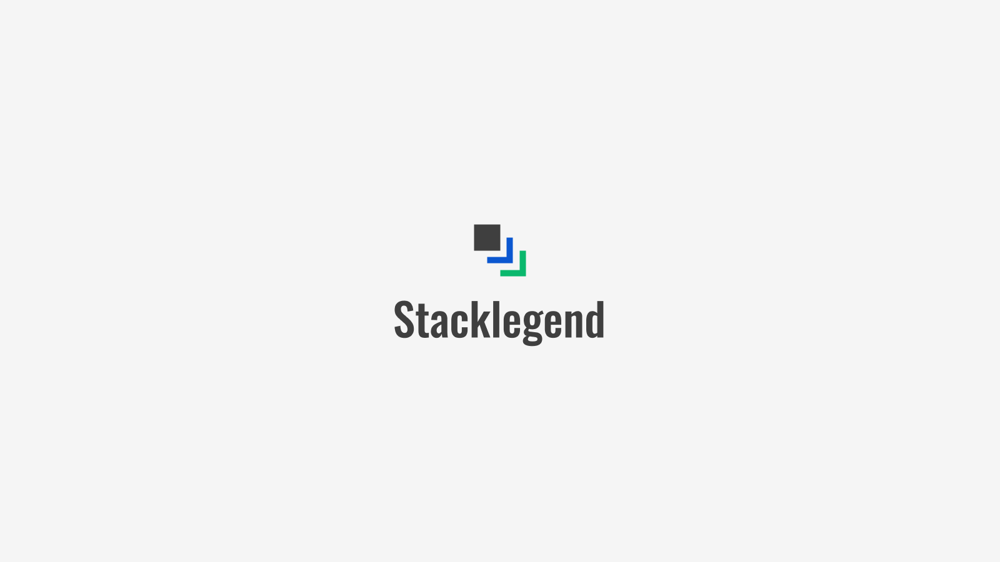

# Welcome to Stacklegend!

We are a team of experts specializing in the implementation of business solutions in the fields of development (Dev) and
operations (Ops). Our extensive corporate experience enables us to provide high-quality services to our clients.

We don't just offer services, we provide comprehensive solutions that deliver tangible results. With a focus on design
precision, robust security, infrastructure optimization, and seamless integration, we are here to strengthen your
business position.

Visit our webiste: [https://stacklegend.com](https://stacklegend.com/)

## Business Benefits of Our Services

We are committed to helping businesses succeed by providing innovative solutions that meet unique needs.

- **Enterprise Solutions** - We offer IT solutions that operate effectively in corporate environments, with security in
  mind.
- **Optimal Choice** - With over 25 years of professional experience, we can be the optimal IT partner for your business.
- **Outstanding Quality** - We always strive to deliver the highest quality with exceptional expertise and experience.
- **24/7 Support** - We are ready to assist you with your issues. With reliable support, you can focus on your business.
- **Dynamic Thinking** - We are flexible, responding quickly to needs and market changes while prioritizing continuous
  feedback.
- **International Experience** - Our knowledge gained from international projects allows us to operate effectively in a
  global environment.

## Services in Our Palette: Innovative Business Solutions

From the very beginning, our goal has been to provide high-quality, reliable IT services to our partners. Over the
years, our range of services has continuously expanded, enabling us to deliver a broad and competitive set of business
solutions.

## [Graphic Design](https://stacklegend.com/en/services/graphic-design)

- ### [Badge and Lanyard Design](https://stacklegend.com/en/services/graphic-design/badge-lanyard-design)
- ### [Banner Design](https://stacklegend.com/en/services/graphic-design/banner-design)
- ### [Brand Design](https://stacklegend.com/en/services/graphic-design/brand-design)
- ### [Brochure and Prospectus Design](https://stacklegend.com/en/services/graphic-design/brochure-prospectus-design)
- ### [Business Card Design](https://stacklegend.com/en/services/graphic-design/business-card-design)
- ### [Desktop Application Design](https://stacklegend.com/en/services/graphic-design/desktop-application-design)
- ### [Flyer Design](https://stacklegend.com/en/services/graphic-design/flyer-design)
- ### [Logo Design](https://stacklegend.com/en/services/graphic-design/logo-design)
- ### [Mobile Application Design](https://stacklegend.com/en/services/graphic-design/mobile-application-design)
- ### [Poster Design](https://stacklegend.com/en/services/graphic-design/poster-design)
- ### [Responsive Web Design](https://stacklegend.com/en/services/graphic-design/responsive-web-design)
- ### [Tablet Application Design](https://stacklegend.com/en/services/graphic-design/tablet-application-design)
- ### [UX/UI Design](https://stacklegend.com/en/services/graphic-design/ux-ui-design)

## [Software Development](https://stacklegend.com/en/services/software-development)

- ### [API Development and Integration](https://stacklegend.com/en/services/software-development/api-development-integration)
- ### [Code Optimization and Refactoring](https://stacklegend.com/en/services/software-development/code-optimization-refactoring)
- ### [Command Line App Development](https://stacklegend.com/en/services/software-development/command-line-app-development)
- ### [Continuous Integration (CI/CD)](https://stacklegend.com/en/services/software-development/continuous-integration-cicd)
- ### [Custom Software Development](https://stacklegend.com/en/services/software-development/custom-software-development)
- ### [Database Design and Development](https://stacklegend.com/en/services/software-development/database-design-development)
- ### [Desktop Application Development](https://stacklegend.com/en/services/software-development/desktop-application-development)
- ### [DevOps and Automation](https://stacklegend.com/en/services/software-development/devops-automation)
- ### [Microservices Development](https://stacklegend.com/en/services/software-development/microservices-development)
- ### [Mobile Application Development](https://stacklegend.com/en/services/software-development/mobile-application-development)
- ### [Quality Assurance and Testing](https://stacklegend.com/en/services/software-development/quality-assurance-testing)
- ### [Web Application Development](https://stacklegend.com/en/services/software-development/web-application-development)
- ### [Website and Online Store Creation](https://stacklegend.com/en/services/software-development/website-online-store-creation)

## [Cybersecurity](https://stacklegend.com/en/services/cybersecurity)

- ### [Access and Permission Management](https://stacklegend.com/en/services/cybersecurity/access-permission-management)
- ### [Audit and Compliance Examination](https://stacklegend.com/en/services/cybersecurity/audit-compliance-examination)
- ### [Cloud Security](https://stacklegend.com/en/services/cybersecurity/cloud-security)
- ### [Data Leak Prevention (DLP)](https://stacklegend.com/en/services/cybersecurity/data-leak-prevention)
- ### [Data Security and Encryption](https://stacklegend.com/en/services/cybersecurity/data-security-encryption)
- ### [Disaster Recovery](https://stacklegend.com/en/services/cybersecurity/disaster-recovery)
- ### [Firewall and Network Security](https://stacklegend.com/en/services/cybersecurity/firewall-network-security)
- ### [Incident Management and Response](https://stacklegend.com/en/services/cybersecurity/incident-management-response)
- ### [Intrusion Prevention (IDS/IPS)](https://stacklegend.com/en/services/cybersecurity/intrusion-prevention)
- ### [Security Awareness Training](https://stacklegend.com/en/services/cybersecurity/security-awareness-training)
- ### [Threat Detection](https://stacklegend.com/en/services/cybersecurity/threat-detection)
- ### [Virus and Threat Protection](https://stacklegend.com/en/services/cybersecurity/virus-threat-protection)

## [System Operation](https://stacklegend.com/en/services/system-operation)

- ### [Application Monitoring](https://stacklegend.com/en/services/system-operation/application-monitoring)
- ### [Cloud Technology](https://stacklegend.com/en/services/system-operation/cloud-technology)
- ### [Data Backup and Recovery](https://stacklegend.com/en/services/system-operation/data-backup-recovery)
- ### [Database Management](https://stacklegend.com/en/services/system-operation/database-management)
- ### [Helpdesk and IT Support](https://stacklegend.com/en/services/system-operation/helpdesk-it-support)
- ### [License and Asset Management](https://stacklegend.com/en/services/system-operation/license-and-asset-management)
- ### [Monitoring and Diagnostics](https://stacklegend.com/en/services/system-operation/monitoring-diagnostics)
- ### [Network Management](https://stacklegend.com/en/services/system-operation/network-management)
- ### [Remote Management and Work](https://stacklegend.com/en/services/system-operation/remote-management-work)
- ### [Security Monitoring](https://stacklegend.com/en/services/system-operation/security-monitoring)
- ### [Server Management](https://stacklegend.com/en/services/system-operation/server-management)
- ### [Software Installation and Updates](https://stacklegend.com/en/services/system-operation/software-installation-updates)
- ### [System Administrator](https://stacklegend.com/en/services/system-operation/system-administrator)
- ### [Virtualization](https://stacklegend.com/en/services/system-operation/virtualization)

## [System Integration](https://stacklegend.com/en/services/system-integration)

- ### [API Integration and Development](https://stacklegend.com/en/services/system-integration/api-integration-development)
- ### [Automated Workflows](https://stacklegend.com/en/services/system-integration/automated-workflows)
- ### [Business Applications Integration](https://stacklegend.com/en/services/system-integration/business-applications-integration)
- ### [Cloud-Based System Integration](https://stacklegend.com/en/services/system-integration/cloud-based-system-integration)
- ### [Data Integration](https://stacklegend.com/en/services/system-integration/data-integration)
- ### [Data Transfer Between Software](https://stacklegend.com/en/services/system-integration/data-transfer-between-software)
- ### [Heterogeneous Systems Integration](https://stacklegend.com/en/services/system-integration/integration-of-heterogeneous-systems)
- ### [Integration Testing](https://stacklegend.com/en/services/system-integration/integration-testing)
- ### [Legacy Systems Integration](https://stacklegend.com/en/services/system-integration/legacy-systems-integration)
- ### [Microservices Integration](https://stacklegend.com/en/services/system-integration/microservices-integration)
- ### [Software Platforms Integration](https://stacklegend.com/en/services/system-integration/software-platforms-integration)
- ### [System and Database Integration](https://stacklegend.com/en/services/system-integration/system-and-database-integration)
- ### [Web Services Integration](https://stacklegend.com/en/services/system-integration/web-services-integration)

## [Business IT Solutions](https://stacklegend.com/en/solutions)

- ### [3CX Phone System](https://stacklegend.com/en/solutions/3cx-phone-system)
- ### [SmarterMail Business Email](https://stacklegend.com/en/solutions/smartermail-business-email)
- ### [TrueConf Video Conferencing](https://stacklegend.com/en/solutions/trueconf-video-conferencing)
- ### [Ubiquiti UniFi Networks](https://stacklegend.com/en/solutions/ubiquiti-unifi-networks)
- ### [Wowza Streaming Engine](https://stacklegend.com/en/solutions/wowza-streaming-engine)

## Contact us

- Via our website: https://stacklegend.com/contact/
- Facebook: https://www.facebook.com/stacklegend/
- Twitter: https://twitter.com/TheStackLegend/
- LinkedIn: https://www.linkedin.com/company/stacklegend/
- Instagram: https://www.instagram.com/stacklegendofficial/
